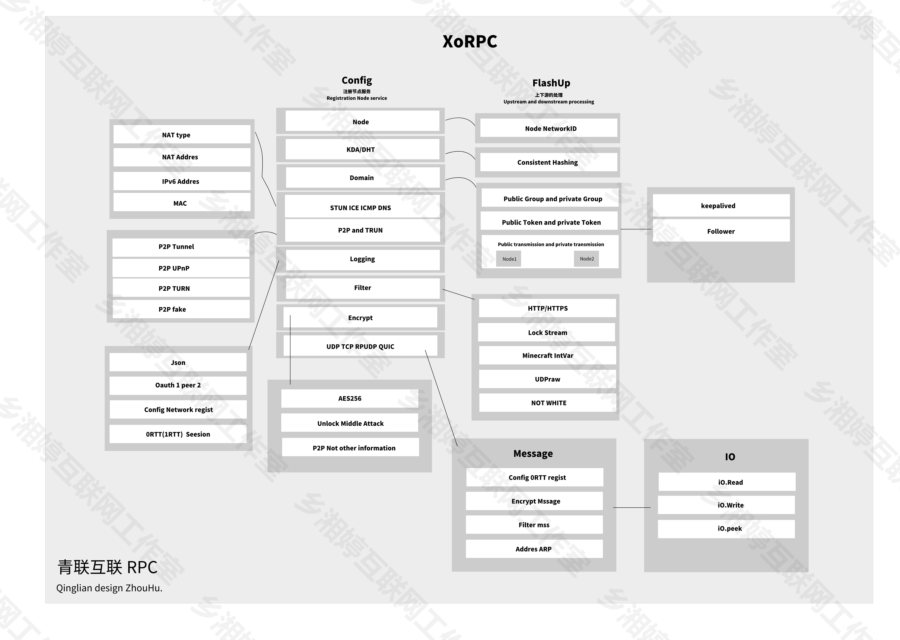
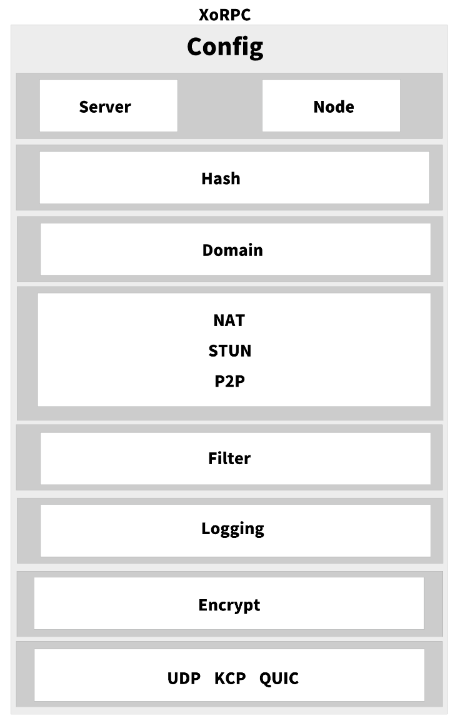

# XoRPC Qiangliang

## 青联RPC
**qingliangRPC** 又名 *XoRPC* 是青联应用通信框架，基于Golang语言开发协助Qingliang Connect(青联互联)使用。

青联RPC可以为青联互联提供点对点通信、loT物联网开发，但并不仅限于。

青联RPC也作为青联互联ARM硬件，在组网上是以青联RPC基础增入组网模式，青联互联ARM硬件的组网开发并不是Go版本，该项目目前尚未实现。青联ARM硬件开发后将会邀请公测，其实相当于软路由上进行组网。不过青联ARM应该是依靠自己的设计主板，CPU方面应该使用天玑or高通作为处理包也使用NPU作为加速合拆解包。

与众不同的是青联RPC可以为青联互联 Minecraft特供，也就是在青联RPC基础上再开发一系列插件达到目的，使用青联达到联机目的。

**乡湘婷**旗下的LanMay岚芒将实验使用青联互联 Minecraft特供版，实现本地Minecraft服务器连接。

（本身此青联RPC和RPC PLUS的用途是自身团队所用）

### 目录

* [开发状态](#开发状态)
* [设计图](#设计图)
* [计划表](#计划表)
    * [保持计划](#保持计划)
    * [其他](#其他)
    * [基本](#基本)
* [赞助](#赞助)

## 开发状态
个人： 由于高中学业繁忙，尽可能完善修复bug。

## 设计图



## Node (服务节点注册)代码示例
```
  	cfgs := new(XoRPC.NodeConfig)
	cfgs.ServiceID = 1001
	cfgs.ServiceName = "Minecraft Connent Node"
	cfgs.Serviceweight = 5
	cfgs.ServiceEncrypt = true
	cfgs.PublicToken = "wss"
	cfgs.PrivateToken = "1145145"
	cfgs.Protocol = "QUIC"
	cfgs.NodeIPV4 = "::"
	cfgs.SerNodePort = 11451
	cfgs.ServiceFilter = true
	cfgs.ServiceFiltertype = "Minecraft"
	cfgs.Run()
```
### Config type
```
type NodeConfig struct {
	// Node ID, This is a virtual id
	// If there is LP plugin management, this is completely managed by LP
	// LP plugin is CN service special version
	ServiceID int
	// the Node Name, This is a virtual name
	ServiceName string
	// Node weight , This is a virtual
	Serviceweight int
	// 通信加密 由AES256和TLS，一般来说QUIC协议默认启用加密

	// encryption enable
	// encryption AES256 and TLS
	ServiceEncrypt bool

	// 过滤器，可为HTTP、HTTPS、Minecraft(IntVar)达到过滤
	// 写入XoRPC是为LP插件使用

	// Filter enable
	ServiceFilter bool
	// Filter type... select HTTP、HTTPS、Minecraft(IntVar)?
	ServiceFiltertype string

	// 公开密钥 与 私密密钥
	// 公开密钥作用是在公域网上被其他节点验证，并且进行通信
	// 私密密钥作用是在广域网上被其他节点验证，并且进行通信与监控
	// 私密密钥具有监控、日志追踪、从新选举主节点作用

	// Public token vry spDimain network
	PublicToken string
	// Private token vry WideArea network
	PrivateToken string

	// Hash分布式，不过不依赖青联LP插件服务的话，完全就是没用的东西。

	// Node setting self Hash
	ServiceGroupHash string

	// 公域网 Public area network
	// 广域网 wide area network
	// spDimain 公域网作用是公开节点地址，用于节点与节点之间在公域上连接。 一般来说RPC会主动拉取主节点或者相邻节点的信息
	// WideArea广域网用于节点与节点私密进行监控、信息交换、类似与局域网。

	// The auto is controlled by DTH and can be partially managed manually
	// WideArea networks are used for node to node privacy for monitoring, information exchange, and similar to local area networks.
	// WideArea network
	Node_widearea_Control map[string]int
	// The auto is controlled by DTH and can be partially managed manually
	// The spDimain(public domain network) is used to expose node addresses and connect nodes on the public domain. Generally speaking, the RPC will actively pull information about the primary node or adjacent nodes
	// spDimain network
	Node_public_spDimain interface{}

	// protocol and IP Addres
	Protocol string
	// Your ipv4 local addres
	NodeIPV4 string
	// Your ipv6 local addres
	NodeIPV6 string
	// Node listen port, If the DTH routing table is used, ports after NAT are displayed
	SerNodePort int

	// - Node Extension -
	// Node traffic forwarding
	TranspondForwar bool
	// Node forward port
	TranspondForwarPort int
	// Node Flow Doamin
	FlowDomain map[string]int

	// Qinglian PLUS version
	// your local rules should be supported.
	// not you computer rules, it's you local. you konw?
	DomainTUNandAPT bool

	NodeNetworkV4 interface{}
	NodeNetworkV6 interface{}
}
```
### 思路
NAT

## 计划表
- [x] 支持IPV6
- [x] 支持QUIC协议
- [ ] 支持免费服务器服务
- [ ] 实现自己一套多路复用方案
- [ ] 支持VarInt过滤器，用于 Minecraft
- [ ] 支持节点之间中转数据
- [ ] 额外开发用于想贡献服务器宽带作为给用户带来更好体验的版本（审核机制严格，国外服务器一律不需要）
- [x] 支持UPNP
- [ ] 支持ICMP隧道
- [ ] 更好的网络延迟计算公式
- [ ] （空想）通过DNS加密获取双方NAT

### 保持计划
1. 逐步实现区块链无中心化，让更多人受益。
2. 保持对Minecraft游戏体验支持。
3. 合作更多人，立志于提供更好服务。

### 其他
1. 用于 青联互联 - 文件互传
 LP（Landslide Pudding/Patch 雪崩补丁）
 - LP 是青联互联用户管理的控制API
 
 CTMP (Connect Transport Mode Pudding/Patch)
 - CTMP 是作为Minecraft开发的服务器（Domain 域，青联抽象的一种类似内网作为构建一张抽象网络，比如私域作为私人节点、公域暴露整个网络节点）私域节点之间互通插件提供转发服务。
 - CTMP 又是为随心计划开发，随心计划又是贡献自己的服务器节点作为中转提供服务。
### 基本
- [x] AES加密
## 赞助
爱发电地址：https://afdian.net/a/Buserpi

我们立志于给任何用户带来更好体验，团队内部时刻保持透明、晴朗。

对于大部分计划，始终公开透明。
